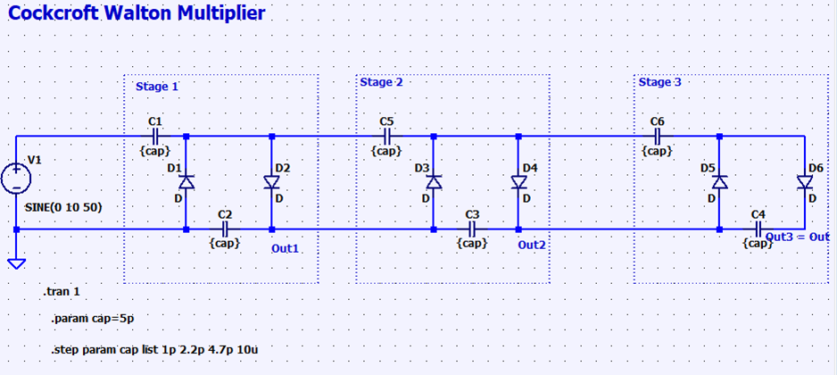
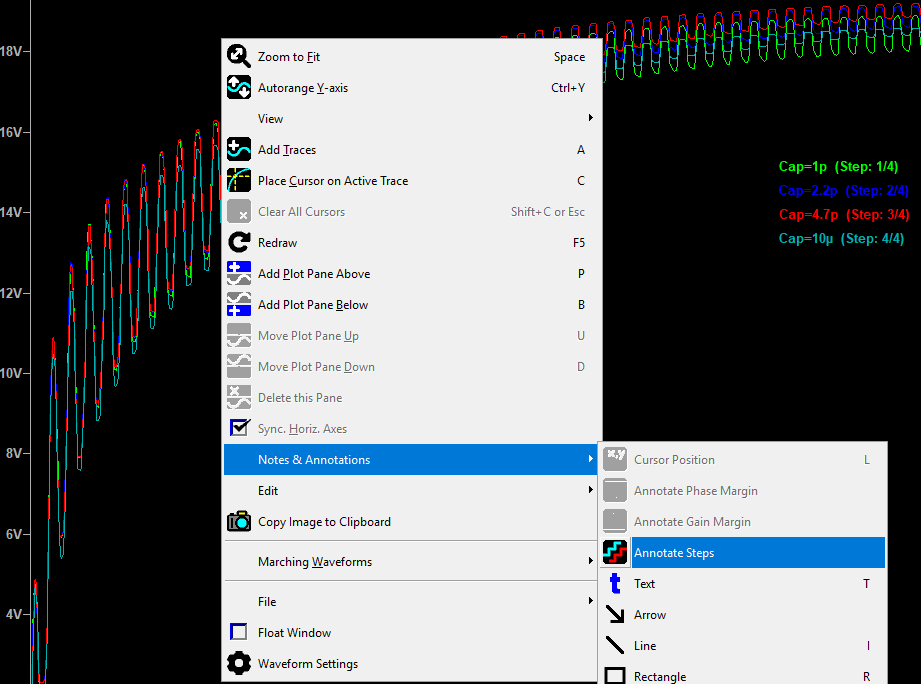

# Simulate with different value using .step

In the example above, we set the value of cap as a parameter so we can sweep it later. 

In LTSpice, we can type `.` then set the value for cap `.param cap=5p`. Next, to see how different cap value affect the circuit we can run `.step param cap list 1p 2.2p 4.7p` those are the values for cap. 

## Visualize all steps

In LTSpice 24 we can right click on the plot and select Note & Annotations > Annotate Steps [1]

# Reference 

[1] https://ez.analog.com/amplifiers/operational-amplifiers/f/q-a/587684/how-to-show-legends-in-ltspice-24-0-12
