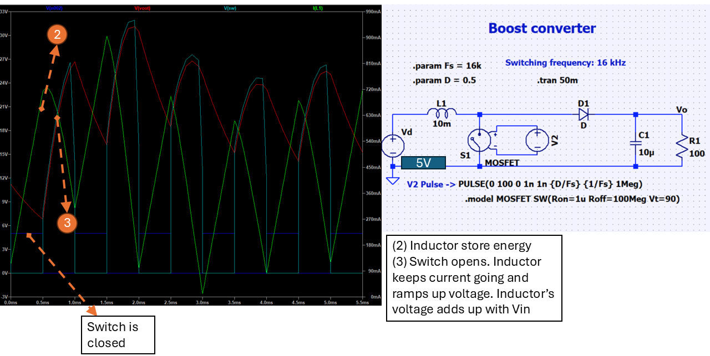
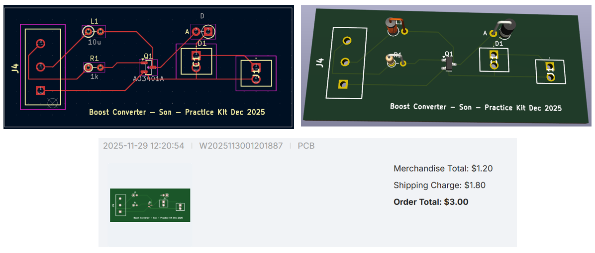
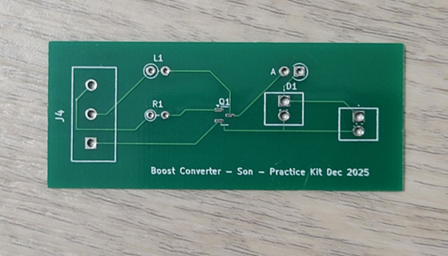
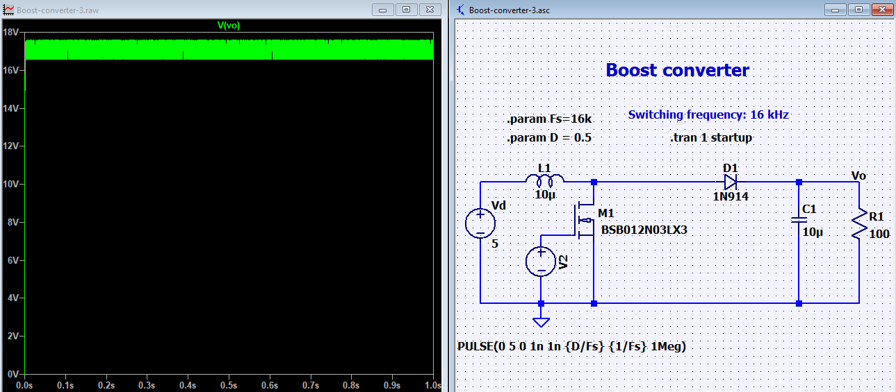
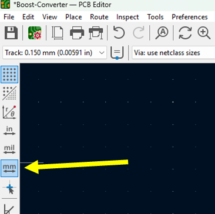

# Boost Converter

Boost converter main component is an inductor. When there is a sudden change in current, the inductor will try to increase voltage to keep that current flow through circuit.

Blue is the switch signal. When the switch is ON, current from inductor ramps up. Most of the current goes to ground. Capcitor discharges that lead to the voltage drop shown above.

## Design in Kicad

So first, to make sure everything work well, I simulate it in LTSpice and TinkerCAD. TinkerCAD allow us to program the Ardunio PWM.

In this circuit, Vin=5V and Vout=50V.

I ordered the PCB in Nov 29th, 2025 and received it about 20 days (Dec 17th, 2025).

## Actual PCB

## Things to improve

### Circuit

After getting the board, I've realized, I did not take into account many things:

- What is the gain and how do we calculate it:
  - There are two type: CCM (continuous conduction mode) and DCM (discontinuous conduction mode)
- What is the maximum current draw from the load.
- What is a good size for trace's width.

The circuit above may operate under DCM and also it may not be correct. The ouput would be different from simulation.

For example, if I replace all ideal components with actual ones. The output voltage now becomes 18V.

### Kicad

For Kicad, we can import design rules to make the circuit better or align with PCB manufacture [5]

We can also set metric in kicad by click on the icon on the left panel.

# Joule Thief

Joule thief is quite similar to boost converter; however, the circuit is more simple [1].

# Reference

[1] https://forum.allaboutcircuits.com/threads/joule-thief-vs-boost-converter-2.184720/#:~:text=Welcome%20to%20AAC.,oscillator%20is%20a%20separate%20circuit.

[2] https://electronics.stackexchange.com/questions/231064/how-do-i-simulate-a-dc-dc-boost-converter-in-ltspice

[3] https://www.ti.com/download/trng/docs/seminar/Topic_3_Lynch.pdf

[4] https://ez.analog.com/ez-blogs/b/engineering-mind/posts/diving-into-coil-events-in-dcm-and-ccm---part-2-of-6

[5] https://github.com/labtroll/KiCad-DesignRules
