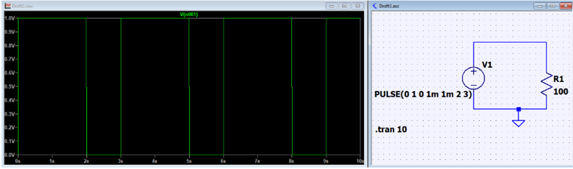
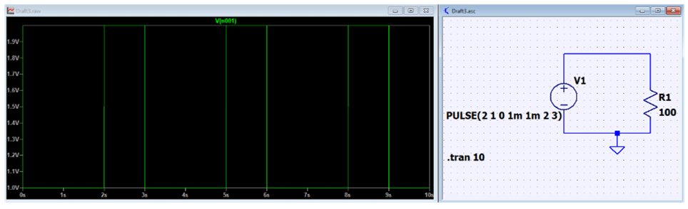
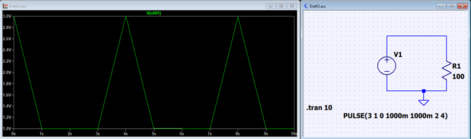

# LTSpice for Beginner

## Pulse

Instead of giving the definition, I provide three example below with different Pulse configuration

The arguments for PULSE are as follow: Vinitial[V], Von[V], Tdelay[s], Trise[s], Tfall[s], Ton[s], Tperiod[s], Ncycle

In the first example above, we set Vinitial is 0. Vinitial is a complement of Von. In simulation, Vinitial will be ran first, 

then either ruse or fall edge depend on the difference of Vinitial and Von. Because the rising edge is too small, we then see Von at 1V right away. 

Next, Von will stay for 2 second followed by a Vinitial of 1 second. 

In the second example, Vinitial is higher than Von. As shown in the second plot, we have a rising pulse around 0s. Then, it drops to 1V for Von. In the last 1 second of the period of 3 second, the signal goes up to Vinitial again which is 2V.

Now, in the last experiement, we increase both Trise and Tfall to 1s. Now, Falling edge for Vinitial is clear. 

## Switch
