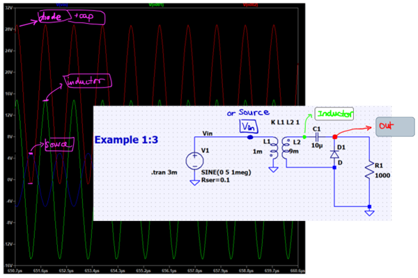

# Voltage Doubler Villard

as in the picture above, we have three main components:

- inductor L
- capacitor C
- and diode D

First, our inductor has ratio of 1:3, and the dot are reverse, so if we input 5V in the primary side, we will get -15V in the output.

Now, that explain why blue (Vin) and green (inductor) signals are opposite of the other. 

Then, the reverse voltage will charge up the capacitor. In the next cycle, the votlage from the inductor and capacitor will add up; therefore, the final ouput votlage is 30V.

# References:

https://electronics.stackexchange.com/a/24211/100724

Online simulation: [falstad.com](https://www.falstad.com/circuit/circuitjs.html?cct=%24+1+5.0E-6+15.472767971186109+50+5.0+43%0AT+272+208+336+256+0+4.0+1.0+-0.002376204843142543+-3.351078308107085E-6+0.999%0Av+208+256+208+208+0+1+60.0+5.0+0.0+0.0+0.5%0Aw+208+208+272+208+0%0Aw+208+256+272+256+0%0Aw+336+208+368+208+0%0Aw+336+256+416+256+0%0Aw+416+256+464+256+0%0Ac+368+208+400+208+0+9.920000000000002E-6+-4.4100686322643075%0Aw+400+208+416+208+0%0Aw+416+208+464+208+0%0Ad+416+256+416+208+1+0.805904783%0Ar+464+208+464+256+0+1000000.0%0Ao+1+64+0+35+5.0+0.0125+0+-1%0Ao+11+64+0+35+10.0+9.765625E-5+1+-1%0A)
