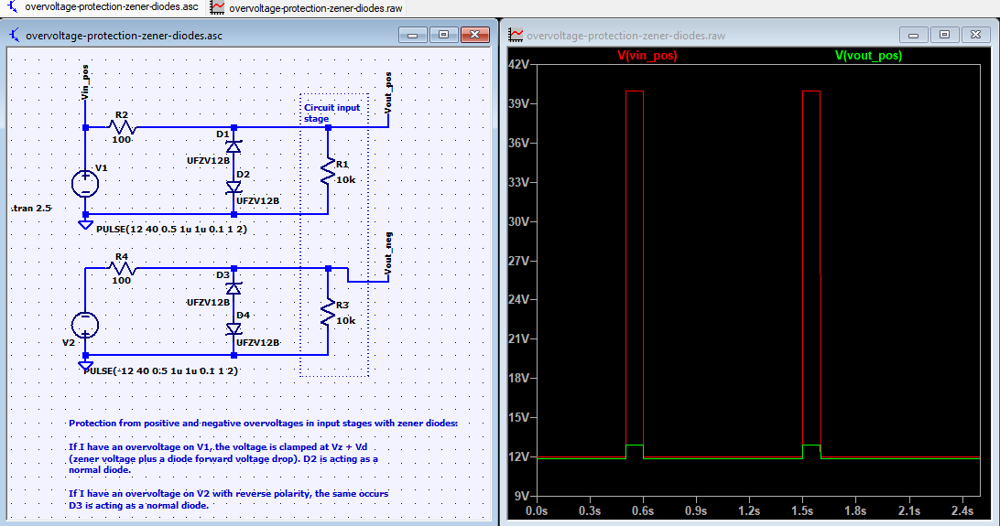
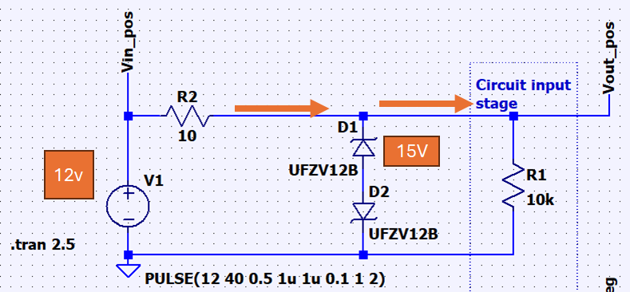
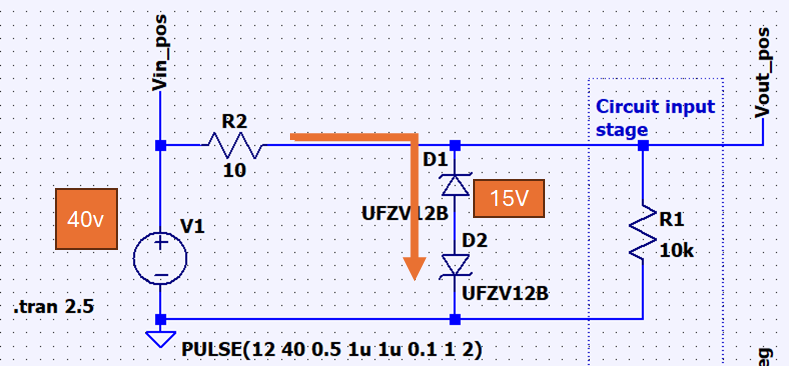

# Overvoltage Protection with Zener Diodes

Change log:

- Swapped BZX84C12 with UFZV12B

# Note

Two zener diodes will clamp voltage 

First, when 12V is apply, D1 acts as reverse-bias, blocking the current. 

Next, when the source change to 40V that exceed the breakdown voltage from the zener. The zener now allows current to flow through.

# Different types of diodes

## Regular

## Schottky

## LED

## Varactor

## Photo-diode

## Transient-voltage-suppression TVS
