## Circuits simulations in LTSpiceIV improved

Continue building more circuit based on [mick001 (Michy)](https://github.com/mick001) repo ([Circuits-LTSpice](https://github.com/mick001/Circuits-LTSpice))

### Motivation

For all the curious kids out there who open their toys to see what inside. Who asking questions at the right time.

### Table of Contents
  - [Amplifiers](#amplifiers)
  - [Basic Electronic Components](#basic-electronic-components)
  - [Basics](#basics)
  - [Common Issues](#common-issues)
  - [Comparator circuits](#comparator-circuits)
    - [other circuits with hysteresis](#other-circuits-with-hysteresis)
  - [Controller-control-systems](#controller-control-systems)
  - [Filters](#filters)
    - [RC](#rc)
    - [RL](#rl)
    - [RLC](#rlc)
  - [How to solder SMD](#how-to-solder-smd)
  - [Input stages](#input-stages)
  - [Loads](#loads)
  - [Logic-circuits](#logic-circuits)
  - [Oscillators-and-Timers](#oscillators-and-timers)
  - [Power-Electronics](#power-electronics)
  - [Power-Sources](#power-sources)
  - [Protection Circuit](#protection-circuit)
    - [Current limiting circuits](#current-limiting-circuits)
    - [Overvoltage protection circuits](#overvoltage-protection-circuits)
  - [Signal-Processing-and-Modulation](#signal-processing-and-modulation)
  - [Simulation-Techniques](#simulation-techniques)
  - [Transformer](#transformer)
    - [Transmission-and-Power-Lines](#transmission-and-power-lines)

---

### Amplifiers

| Name                                            | Img                                            |
| ----------------------------------------------- | ---------------------------------------------- |
| A-class-amplifier-bjt.asc                       | 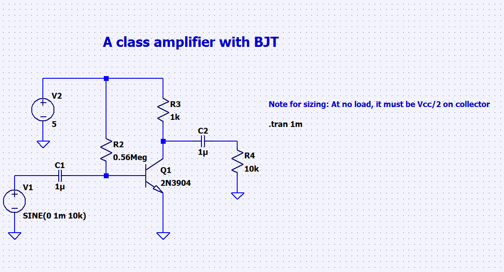 |
| BJT-emitter-follower-configuration.asc-         | 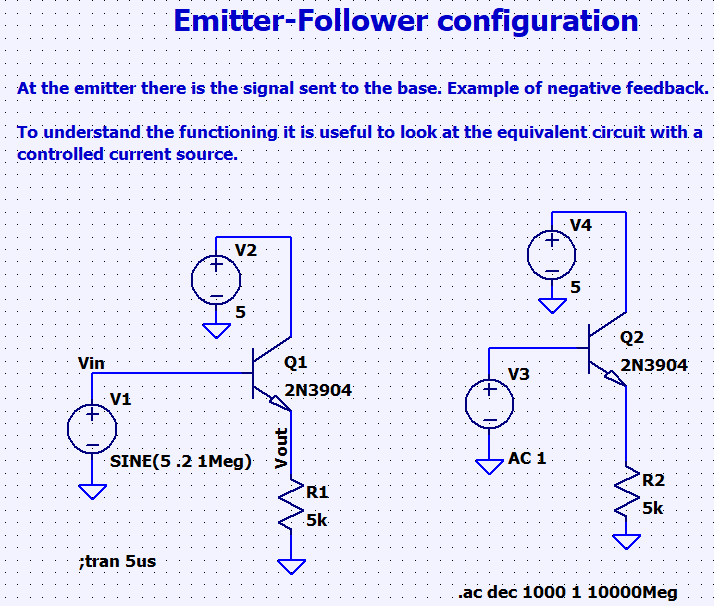 |
| Common-collector-emitter-follower-amplifier.asc | 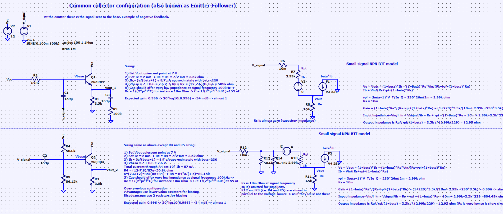 |
| Common-emitter-amplifier-design.asc             | 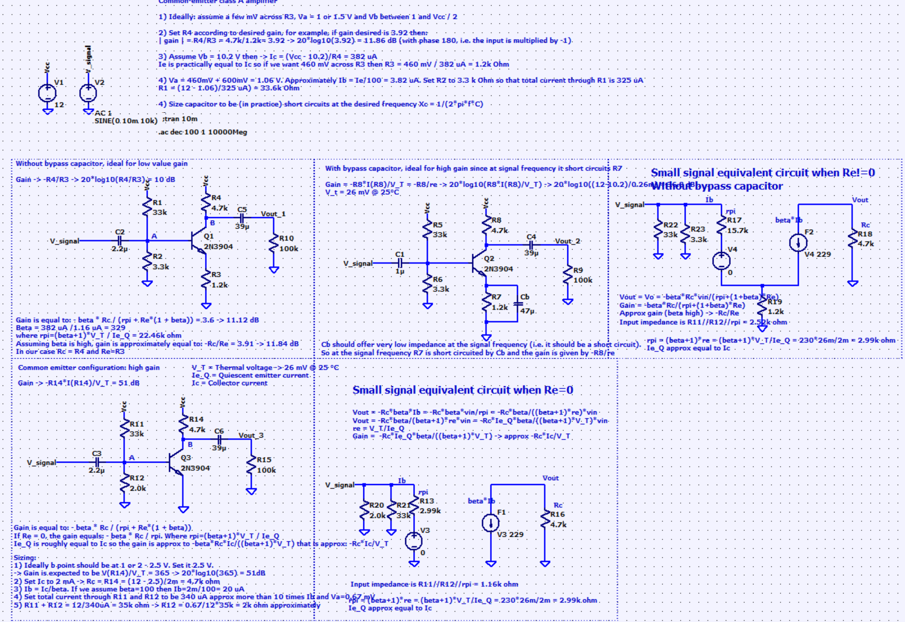 |
| Common-emitter-BJT.asc                          | 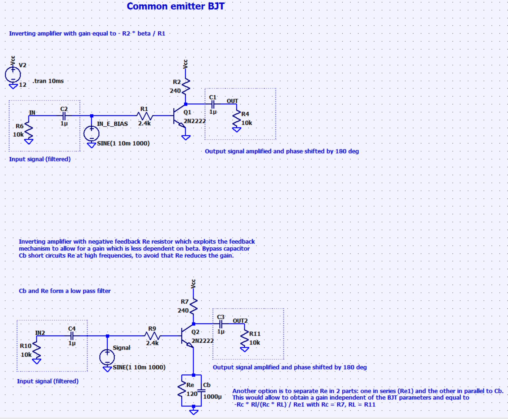 |
| Differences-amplifier.asc                       | 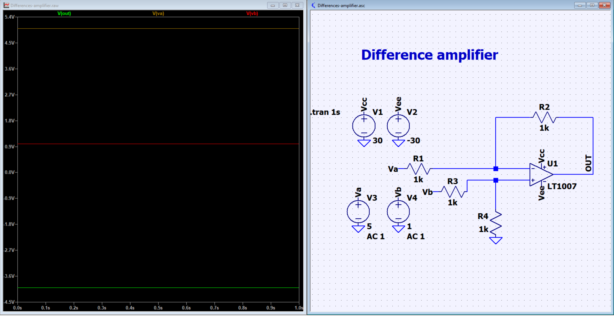 |
| Differential-pair.asc                           | 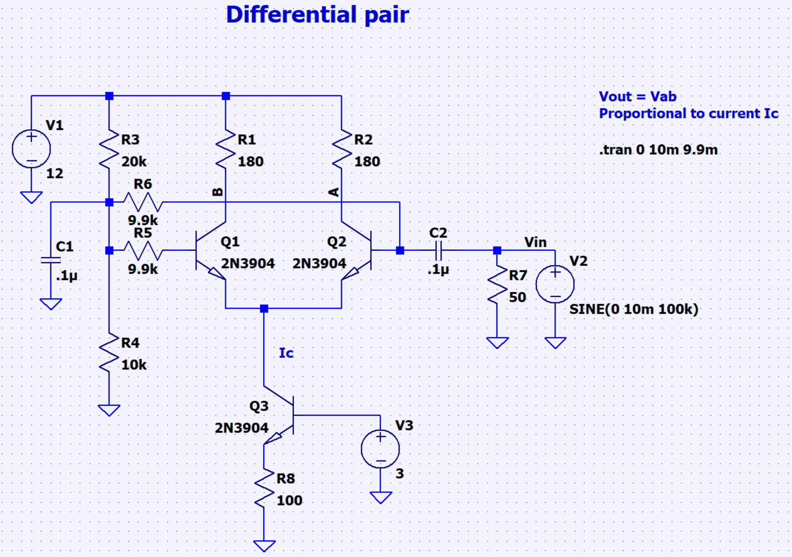 |
| Double-stage-common-emitter-amplifier.asc       | 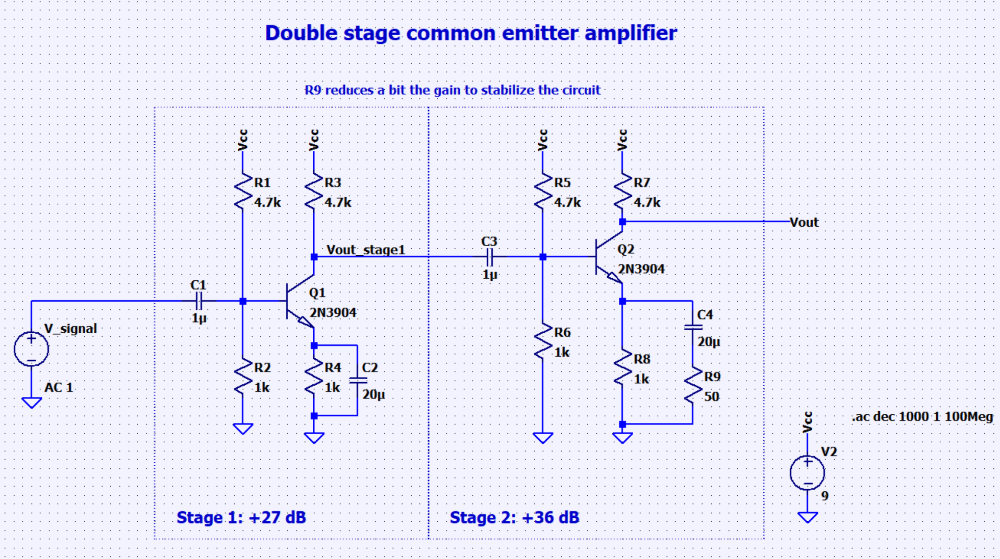 |
| Instrumentation-amplifier.asc                   | 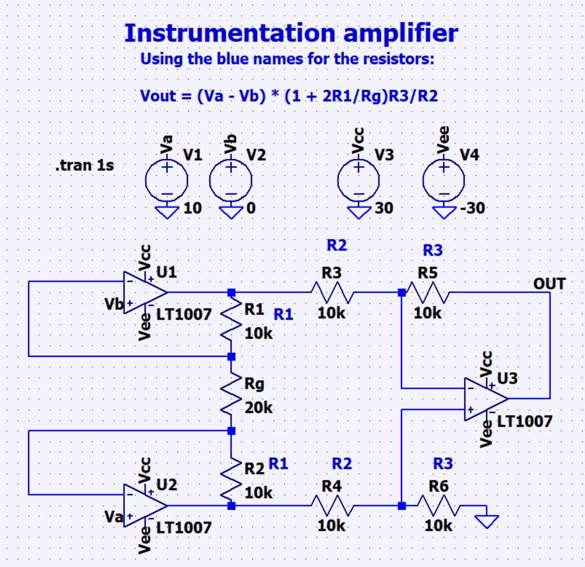 |
| Push-pull-amplifier-AB-BJT.asc                  | 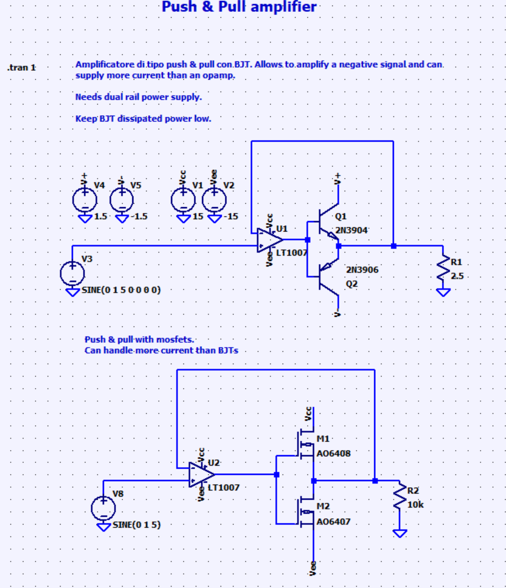 |
| Push-pull-amplifier-operational-amplifier.asc   | 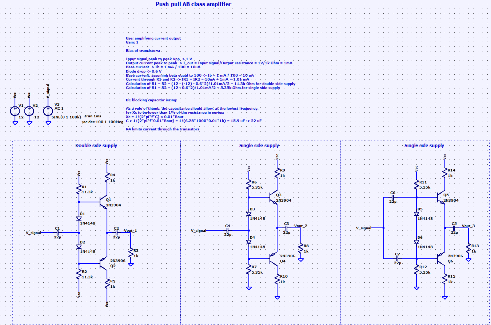 |
| Push-pull-amplifier.asc                         | 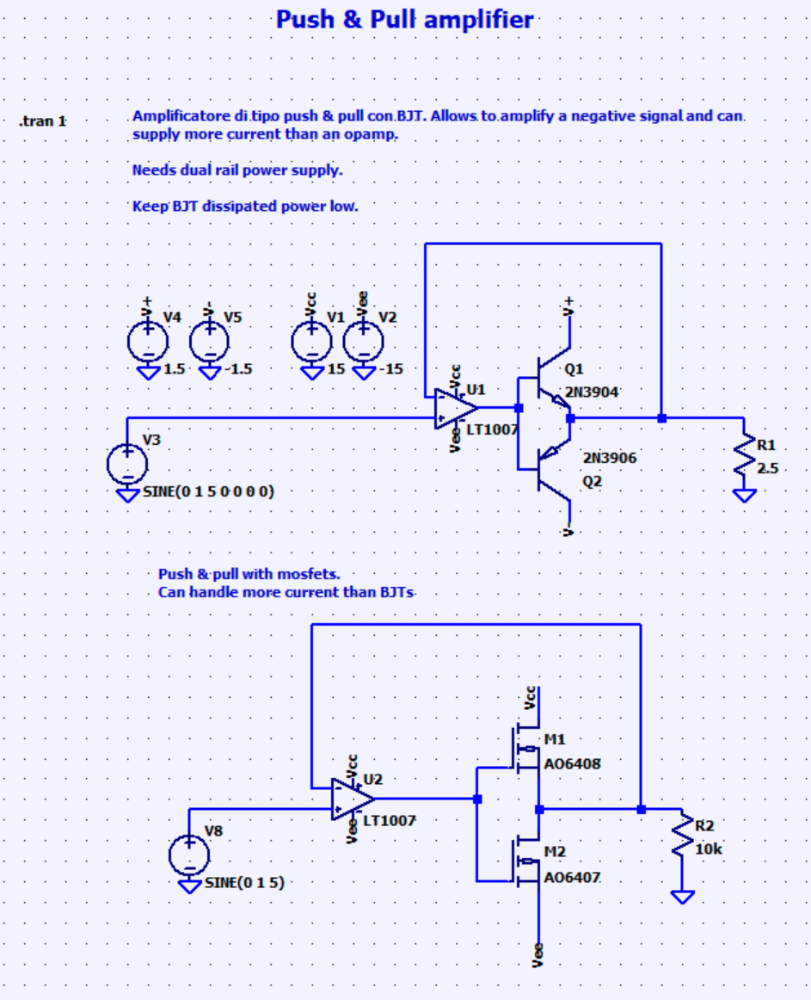 |

### Basic Electronic Components

| Name     | Img |
| -------- | --- |
| Diode.md |     |
| OpAmp.md |     |

### Basics

| Name                                  | Img                                                                                                                                             |
| ------------------------------------- | ----------------------------------------------------------------------------------------------------------------------------------------------- |
| DC-transfer-function-analysis.asc     | 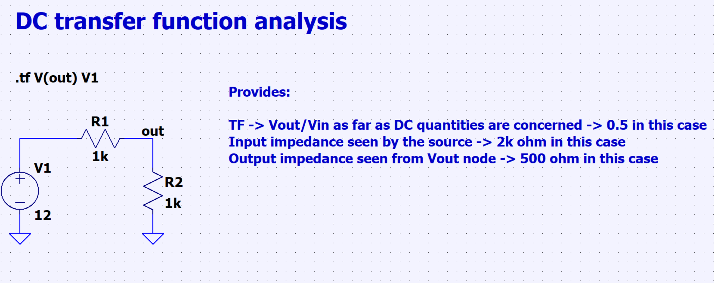                                                                                                  |
| Example-of-DC-sweep.asc               |                                                                                                   |
|                                       | In this example, voltage is swept from -10 to 10V, as voltage source greater than 0V, the voltage drop is about 0.7V from the diode side  |
| How-to-set-initial-conditions.asc     |                                                                                                   |
| Parallel-resistor-when-negligible.asc |                                                                                                   |
| PNP-transistor-biasing.asc            |                                                                                                   |
| Transistor-beta.asc                   |                                                                                                   |

### Common Issues

| Name               | Img/Des |
| ------------------ | ------- |
| Undefined Model.md |         |

### Comparator circuits

| Name                                                      | Img                                            |
| --------------------------------------------------------- | ---------------------------------------------- |
| Comparator-with-hysteresis-asymmetrical-window.asc        |  |
| Comparator-with-hysteresis-symmetrical-window.asc         |  |
| Comparator-with-hysteresis-window-shifted-from-origin.asc |  |
| comparatore-con-isteresi-finestra-shifted-calculations.py |                                                |
| Window-comparator.asc                                     |  |
| zero-crossing-detector-2.asc                              |  |
| zero-crossing-detector.asc                                |  |

#### other circuits with hysteresis

| Name                       | Img                                            |
| -------------------------- | ---------------------------------------------- |
| schmitt_trigger_bjts.asc   |  |
| schmitt_trigger_bjts_2.asc |  |

### Controller-control-systems

| Name                                   | Img                                            |
| -------------------------------------- | ---------------------------------------------- |
| Bang-bang-control.asc                  |  |
| Buck-converter-closed-loop-control.asc |  |
| PD-controller.asc                      |  |

### Filters

#### RC

| Name                                    | Img |
| --------------------------------------- | --- |
| RC-bandpass-filter-frequency-domain.asc |     |
| RC-highpass-frequency-domain.asc        |     |
| RC-lowpass-frequency-domain.asc         |     |
| RC-lowpass-cascaded.asc                 |     |
| RC-lowpass-step-response.asc            |     |
| RC-lowpass.asc                          |     |
| RC-sawtooth-response.asc                |     |
| RC-square-wave-response.asc             |     |
| RC.py                                   |     |

#### RL

| Name            | Img |
| --------------- | --- |
| RL-highpass.asc |     |
| RL-lowpass.asc  |     |
| RL.py           |     |

#### RLC

| Name                                                      | Img |
| --------------------------------------------------------- | --- |
| LC-and-RC-series-bandpass-filter.asc                      |     |
| Notch-and-band-suppress-filters.asc                       |     |
| RLC-critically-damped-series-parallel.py                  |     |
| RLC-overdamped-series-parallel.py                         |     |
| RLC-step-response-example.asc                             |     |
| RLC-step-response-resonance-frequency-series-parallel.asc |     |
| RLC-underdamped-series-parallel.py                        |     |

### How to solder SMD

### Input stages

| Name                         | Img/Des |
| ---------------------------- | ------- |
| professional-input-stage.asc |         |
|                              |         |

### Loads

| Name                     | Img/Des |
| ------------------------ | ------- |
| constant-P-R-I-loads.asc |         |
|                          |         |

### Logic-circuits

| Name                               | Img                                            |
| ---------------------------------- | ---------------------------------------------- |
| Logic-gates-diodes-transistors.asc |  |
| Logic-gates-transistors-BJTs.asc   |  |

### Oscillators-and-Timers

| Name                                                 | Img |
| ---------------------------------------------------- | --- |
| 555 - Astable mode.asc                               |     |
| 555 - Monostable mode.asc                            |     |
| 555-astable-mode.asc                                 |     |
| 555-bistable-mode.asc                                |     |
| 555-monostable-mode.asc                              |     |
| 555-raw-astable-mode.asc                             |     |
| 555-raw-monostable-mode-temporizzatore.asc           |     |
| 555-timer.asc                                        |     |
| Adjustable-duty-cycle-555-square-wave-oscillator.asc |     |
| Astable-multivibrator.asc                            |     |
| LED-blinking-oscillator.asc                          |     |
| Peak-trigger-circuit.asc                             |     |
| Phase-shift-oscillator-RC.asc                        |     |
| Phase-shift-oscillator.asc                           |     |
| Royer-zvs.asc                                        |     |
| Sawtooth-oscillator.asc                              |     |
| Sensor-triggered-timer-temporizzatore-1.asc          |     |
| Sensor-triggered-timer-temporizzatore-2.asc          |     |
| Sensor-triggered-timer.asc                           |     |
| Variable-duty-cycle-square-wave.asc                  |     |
| Wien-oscillator.asc                                  |     |

### Power-Electronics

| Name                                                  | Img                                            |
| ----------------------------------------------------- | ---------------------------------------------- |
| Boost-converter-1.asc                                 |  |
| Boost-converter-2.asc                                 | 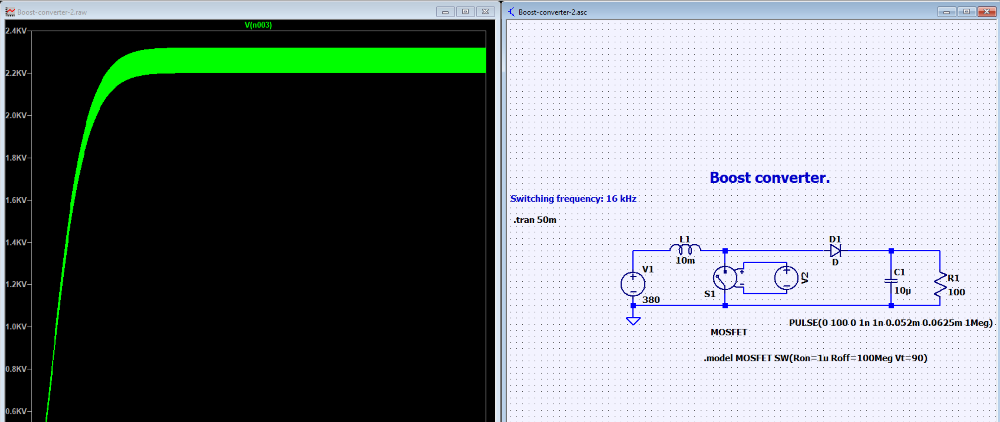 |
| Buck-converter.asc                                    |  |
| Cockcroft-walton-multiplier.asc                       |  |
| DCDC-full-bridge.asc                                  |  |
| Full-bridge-inverter.asc                              |  |
| Full-bridge-rectifier.asc                             | 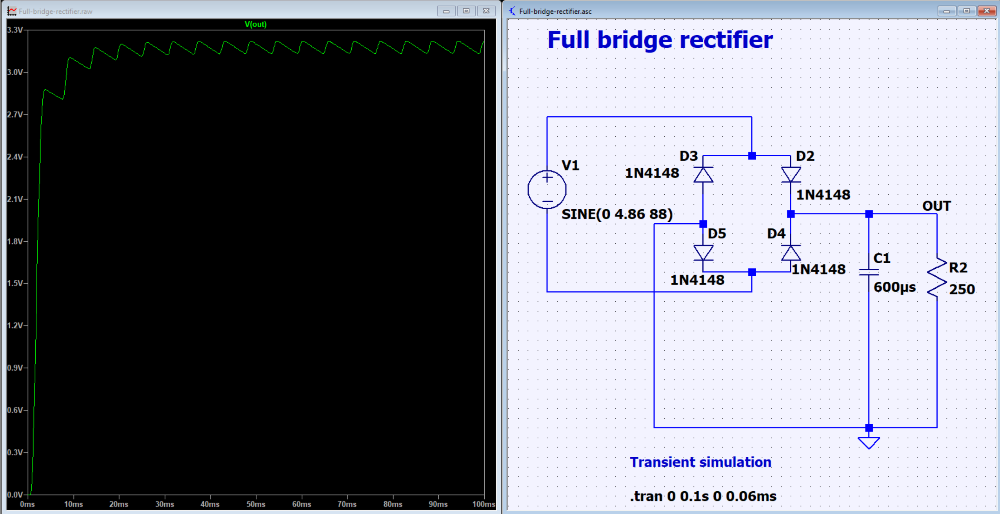 |
| Half-bridge-inverter.asc                              |  |
| Single-phase-rectifier-constant-current-load.asc      |  |
| Single-phase-rectifier-constant-voltage-load.asc      |  |
| Single-phase-rectifier-R-load-smoothing-capacitor.asc |  |
| soft-starter-12V.asc                                  |  |
| Three-phase-full-bridge-inverter.asc                  |  |
| Three-phase-naive-inverter.asc                        |  |
| Three-phase-naive-supply-system.asc                   |  |
| Three-phase-rectifier.asc                             |  |
| Example-gain-symbols.asc                              |  |

### Power-Sources

| Name                                        | Img |
| ------------------------------------------- | --- |
| Current-mirrors.asc                         |     |
| Current-source-BJT.asc                      |     |
| Raw-voltage-regulator-with-zener-diode..asc |     |
| Voltage-regulator-npn.asc                   |     |

### Protection Circuit

| Name                       | Img/Des |
| -------------------------- | ------- |
| PTC_Fuse_Calculation.ipynb |         |
|                            |         |

#### Current limiting circuits

| Name                                  | Img |
| ------------------------------------- | --- |
| BJT-for-simple-current-regulation.asc |     |
| current-limiting-npn.asc              |     |
| current-limiting-npn.db               |     |
| current-limiting-npn.log              |     |
| current-limiting-npn.op.raw           |     |
| current-limiting-npn.raw              |     |

#### Overvoltage protection circuits

| Name                                    | Img |
| --------------------------------------- | --- |
| overvoltage-protection-zener-diodes.asc |     |
| overvoltage-protection-zener-diodes.md  |     |
| overvoltage-protection-zener-diodes.raw |     |

### Signal-Processing-and-Modulation

| Name                                    | Img |
| --------------------------------------- | --- |
| AM-FM-signals-sources.asc               |     |
| AM-modulator-bjt.asc                    |     |
| AM-modulator-jfet.asc                   |     |
| Analog-multiplier.asc                   |     |
| ASK-modulation.asc                      |     |
| ASK-modulation2.asc                     |     |
| ASK-modulation3.asc                     |     |
| diode-ring-mixer.asc                    |     |
| Inverting-integrator-and-derivative.asc |     |
| Inverting-sum.asc                       |     |
| Non-inverting-derivative.asc            |     |
| Non-inverting-integrator.asc            |     |
| Non-inverting-sum.asc                   |     |
| PWM-modulation.asc                      |     |

### Simulation-Techniques

| Name                                             | Img |
| ------------------------------------------------ | --- |
| Monte-Carlo-Simulation-LTSpice.asc               |     |
| Noise-simulation-example.asc                     |     |
| Temperature-sweep-simulation.asc                 |     |
| Temperature-Variation-and-Worst-case-LTSpice.asc |     |
| Temperature-Variation-LTSpice.asc                |     |
| Worst-Case-Scenario-2-Simulation-LTSpice.asc     |     |
| Worst-Case-Scenario-Simulation-LTSpice.asc       |     |

### Transformer

| Name                                      | Img                                            |
| ----------------------------------------- | ---------------------------------------------- |
| Example-of-mutually-coupled-inductors.asc |  |
| Transformer-step-down-2-1.asc             |                                                |
| Transformer-step-down-5-1.asc             |                                                |
| Transformer-step-down-up.asc              |                                                |

#### Transmission-and-Power-Lines

| Name                                            | Img |
| ----------------------------------------------- | --- |
| Ferranti-effect-calculations.xlsx               |     |
| Ferranti-effect-lines.asc                       |     |
| Lossless-transmission-line-DC-transient.asc     |     |
| Lossless-transmission-line-pulse.asc            |     |
| Power-line-power-transmission-calculations.xlsx |     |
| Power-line-power-transmission.asc               |     |
